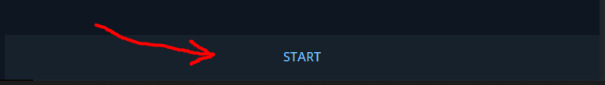
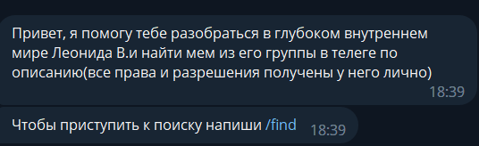
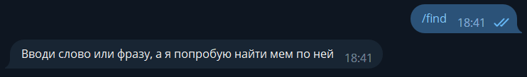
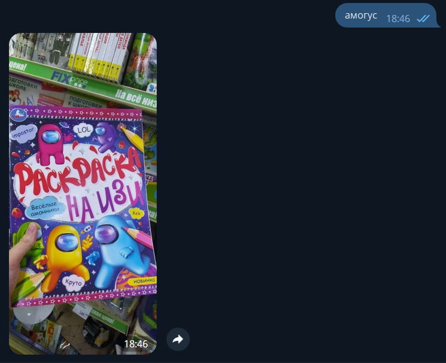
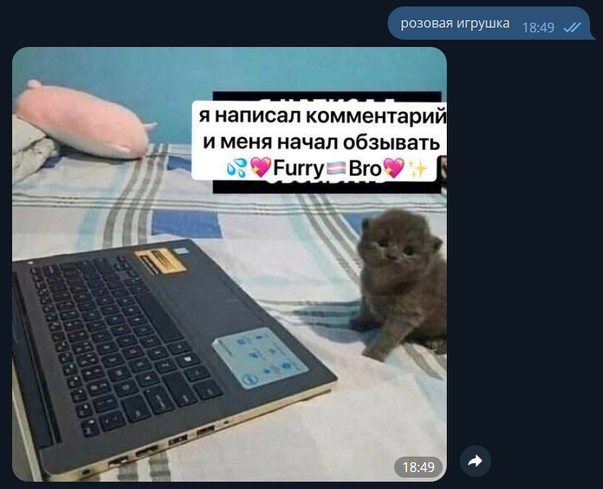
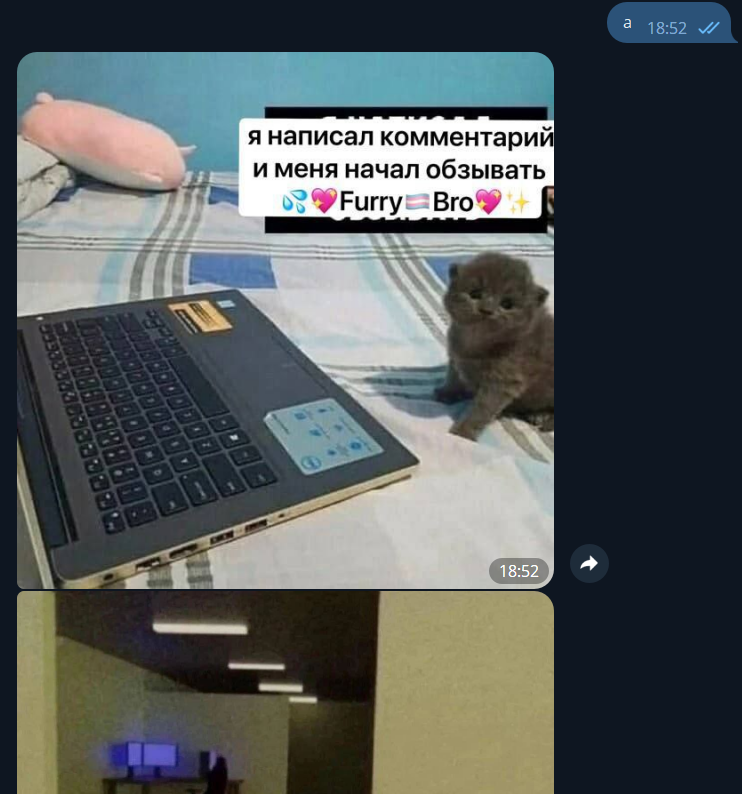
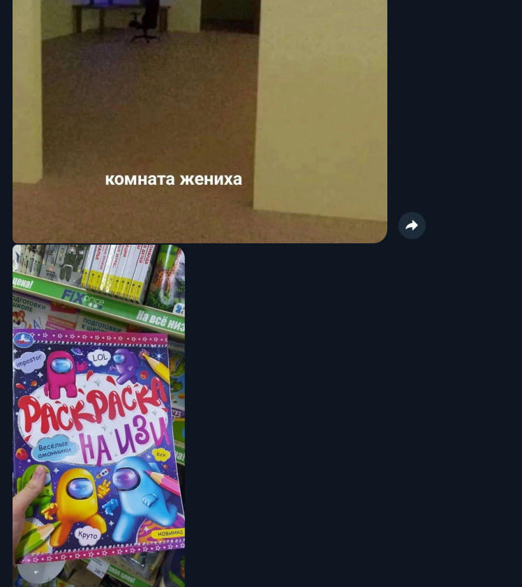
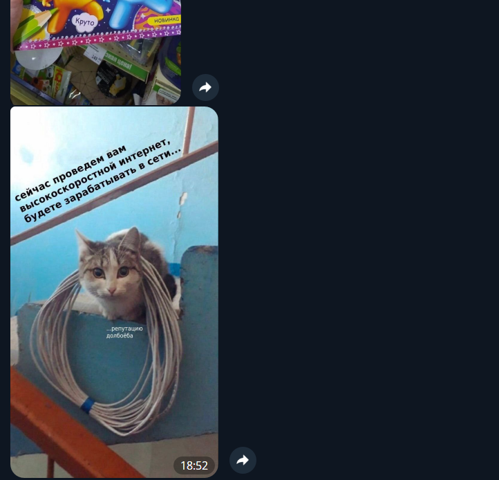

# Руководство пользователя

Для старта работы с ботом нажмите кнопку "START" внизу диалогового окна:

<figure><figcaption></figcaption></figure>

<figure><figcaption></figcaption></figure>

После ввода команды "/find" или нажатия на синюю надпись, вам будет предложено ввести запрос, по которому бот найдет мемы, попадающие под этот запрос

<figure><figcaption></figcaption></figure>

Вы можете ввести как одно слово, так и ключевую фразу (если уверены в ее правильности), так и даже одну букву.&#x20;



<figure><figcaption></figcaption></figure>



<figure><figcaption></figcaption></figure>




<figure><figcaption></figcaption></figure>

 

<figure><figcaption></figcaption></figure>

 

<figure><figcaption></figcaption></figure>





ВАЖНО! Для каждого отдельного запроса необходимо заново прописывать команду "/find"


